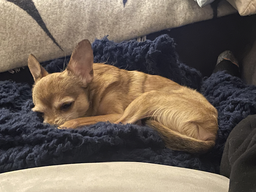

* draw player sprite
* figure out color palette stuff
	* 16 colors with gradients?
* gets smaller as they get away from camera
* can talk with npc
* new background
* sound


# 6/1
hehe


# 5/28

got the dumb sprite to render :)

now to animate


---
# 5/26
ok another side quest to [blockds](https://blocksds.skylyrac.net/docs/)

we are in blocksds world now woo. was pretty painless actually woo

---
# 5/24
i will def get back to the sprite animation, but i went on a little meander into how the video ram stuff works.  going to convert the bitmap background to a tiled backbround

---
# 5/23

lets see if we can animate an idle animation

---
5/21

lol it's too big

```
/opt/devkitpro/devkitARM/bin/../lib/gcc/arm-none-eabi/15.1.0/../../../../arm-none-eabi/bin/ld: region `lma9' overflowed by 5597720 bytes
```

resized


omg


---
5/20


how do i render him on the nintendo ds system

oh wait obsidian doesn't even like heics

first i need to make it a png

built imagemagick from source, so annoying <https://imagemagick.org/script/install-source.php>

my dream is that i don't have to keep doing this for everything. once it's on my system it's good now

ohh there's a thing called grit <https://www.coranac.com/man/grit/html/grit.htm>


ok what i'm going to try to do is render a background

ok looking at examples here <https://github.com/devkitPro/nds-examples/tree/master/Graphics/Backgrounds>

the 256 and 16 bit color examples look the same....

i wonder how they get the image in the right format

---

ok now to render an image...

starting with this example: <https://github.com/devkitPro/nds-examples/tree/master/Graphics/Sprites/simple>

looks like this


---
---

trying to make a game for the nintendo ds

basically following this: <https://devkitpro.org/wiki/Getting_Started> to get the right libraries installed

using this example to get started: <https://github.com/devkitPro/nds-examples/tree/master/hello_world>

emulator:
- desmume was not working...
- melonds also was not working...

built melonds from source woo

got it working!


